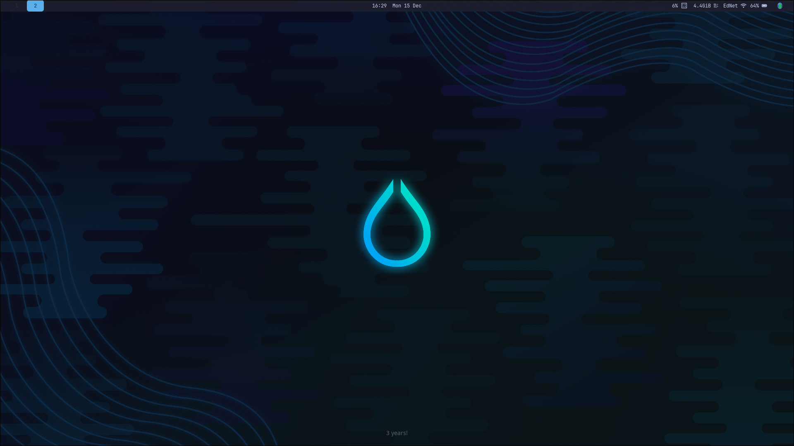

   # Blue HyprArch Rice

   A clean, lightweight, blue-themed Hyprland setup with:
   - Waybar (top bar with CPU/memory/network)
   - nwg-dock-hyprland (bottom dock with auto-hide)
   - hyprlock (beautiful blue lock screen)
   - Kitty terminal with powerlevel10k
   - Wofi launcher
   - Rounded corners, blur, shadows

   ## Screenshots
   
   

   ## Installation
   1. Install Hyprland and dependencies (on Arch):
      ```
      sudo pacman -S hyprland waybar wofi kitty grim slurp wl-clipboard nwg-dock-hyprland hyprlock
      yay -S catppuccin-gtk-theme-sapphire catppuccin-cursors-sapphire ttf-jetbrains-mono-nerd
      ```
   2. Copy configs:
      ```
      cp -r hypr ~/.config/
      cp -r waybar ~/.config/
      cp -r nwg-dock-hyprland ~/.config/
      # etc.
      ```
   3. Reload or reboot

   Enjoy the rice! 🚀